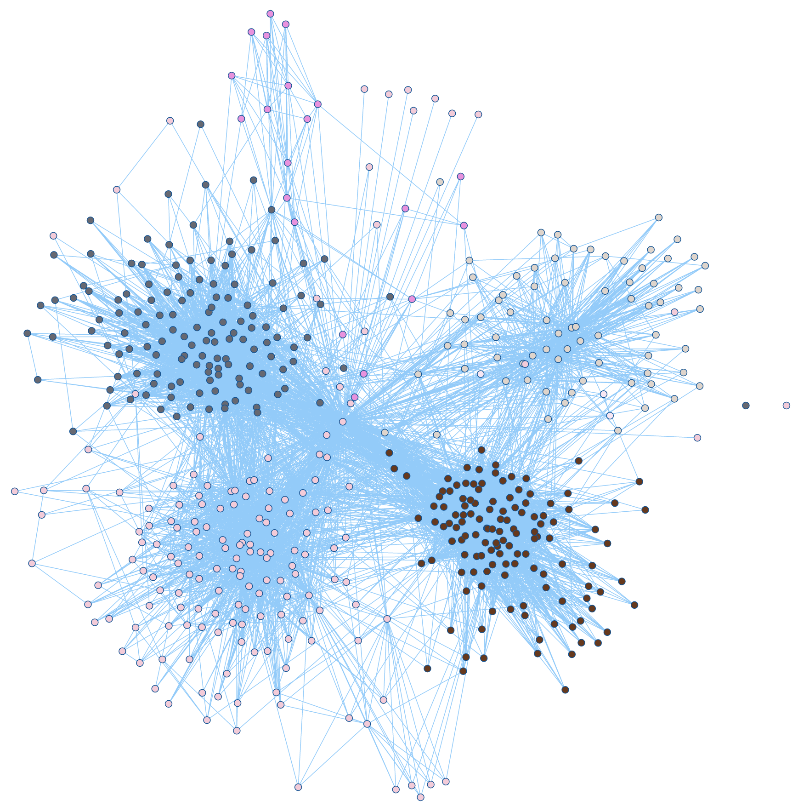

# Instagraph

Witaj w Readme Instagraph, narzędzia pozwalającego na wizualizację grafów społecznych i wykrywanie społeczności i optymalizację działań mających na celu zatrzymanie rozpowrzechniania się koronawirusa w szkołach.

 
# Aby zacząć
[Pobierz Neo4j Desktop](https://neo4j.com/download/) oraz utwórz w niej bazę danych. Zainstaluj w niej APOC, możesz to zrobić klikając ikonkę trzech kropek koło nazwy utowrzonej przez ciebie bazy. 
Pobierz potrzbne biblioteki Pythona:
 - instaloader
 - igraph
 - py2neo
 - neo4j
 
 Powyższe biblioteki umożliwiają modułom pobieranie danych i zarządzanie nimi w utworzonej przez ciebie bazie danych Neo4j.

Zaimportuj moduły z repozytorium Inastagraph'u:

    import neo4j_module
    import igraph_module 
Ustaw połącznie z utworzoną przez siebie bazą danych. Pamiętaj, musi być ona uruchomiona w Neo4j Desktop. ` neo4j_module.establish_database_connection(uri, auth)`.
Gdzie ` uri` jest protokołem stosowanym przez Neo4j, a `auth` jest tuplą ` ('neo4j',password)`
gdzie ` password` jest hasłem do utworzonej przez ciebie bazy w Neo4j.
Przykładowe użycie:

    neo4j_module.establish_database_connection(uri="bolt://localhost:7687", auth=("neo4j", 'password1234')
Jeżeli połącznie się nie powiedzie, pojawi się komunikat oraz wykona się `sys.exit()`

## Importowanie danych z Instagrama 
Zaloguj się do istniejącego konta na Instagramie(rekomendujemy nieużywanie swojego oficjalnego konta).

    neo4j_module.login(login, password)

Instagraph wspiera pobieranie relacji pierwszego oraz pierwszego i drugiego stopnia naraz bezpośrednio do bazy danych.

Aby sprawdzić czy można pobrać relacje użytkownika, należy użyć:

    neo4j_module.user_accessibility(username)
   która zwróci `True` jeśli dane są dostępne lub `False` jeśli nie są.
#
Importowanie relacji pierwszego stopnia dla użytkownika`username`:

    neo4j_module.first_degree_relations(username)

# 
Importowanie relacji pierwszego i drugiego stopnia dla użytkownika`username`:   

    neo4j_module.first_degree_relations(username)

# Analiza społeczności
Jeżeli pobrałeś już wystaczającą ilość danych, możesz przeprowadzić detekcję społeczności.
Aby przeprowadzić analizę na społeczności wokół danego konta, tworzymy graph:

    g = igraph_module.final_graph(username)

Zależenie od pożądonego przez ciebie czasu oraz dokładności danych zawartch danych, rekomendujemy używanie filtrów:

 -Filtr wierzchołków o danym stopniu wchodzącymm`igraph_module.indegree_filter(g,start,stop)` 
 - Filtr wierzchołków o danym stopniu wchodzącymm`igraph_module.outdegree_filter(g,start,stop)` 

, gdzie `g` jest wejściowym grafem, `start ` jest dolną granicą zasięgu a `stop`górną. W przypadku zostawienia `stop`na wartość domyślną, przyjmie on największą możliwą wartość w grafie.
Przykładowe użycie:

     g = igraph_module.outdegree_filter(g,2)
Użycie filtrów nie jest konieczne, ale może poprawić przejrzystość danych i prędkość ich odczytu z bazy danych.
Bezpośrednia analiza społeczności jest wykonowyana za pomocą funkcji `igraph.final_social_data(g)`:

    print(igraph_module.final_social_data(g))
Funkcja zwróci zagnieżdżoną listę, gdzie 
   
 - `list[0]`jest listą tupli `(username, cluster_index)` opisujących nazwy wierzchołków  w grafie oraz ich przynależność do społeczności
 - `list[1]`jest listą tupli `(source, target)` opisujących przebieg relacji w grafie
Dane te w przyszłej wersji programu będą połaczone z narzędziem wizualizującym.  

# Django

Aby sciągnąć django należy najpierw posiadać pythona zainstalowanego na systemie.
Następnie trzeba sciągnąć Django poprzez wpisanie komend: `pip install django` oraz `pip install django-admin`
Po zainstalowaniu można włączyć serwer. Z faktu iż jest to wersja demo, baza danych nie jest potrzebna. 

## Włączenie serwera

`python manage.py runserver`
Powinien wyświetlić się następujący komunikat:
`System check identified no issues (0 silenced).
Django version 3.1.2, using settings 'Instagraph.settings'
Starting development server at http://127.0.0.1:8000/
Quit the server with CTRL-BREAK.`

## Wizualizacja
Aby uzyskać wizualizację, należy wejsć na adres: `http://127.0.0.1:8000/`

